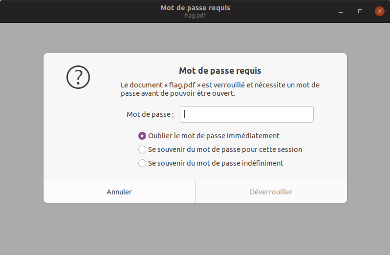
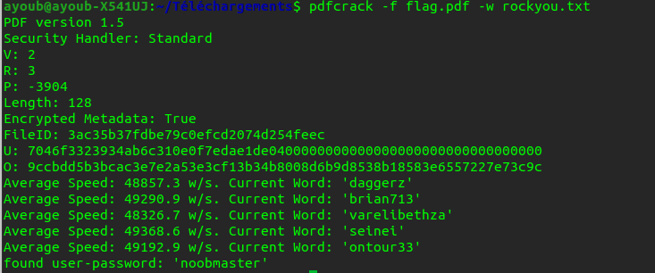

# **Crack & Crack**
## **Task**
Just Crack & Crack! 

* [Task](https://ctf.n00bzunit3d.xyz/challenges#Crack%20&%20Crack-8)

* Author: NoobMaster

* 500 **pts**

## **File**

## **Steps**

the pdf file zipped with password 

we will use a dictionary attack to crack a ZIP password with **fcrackzip**

	fcrackzip -u -D -p rockyou.txt flag.zip

* -u (–use-unzip); helps with false positives
* -D (–dictionary); selects dictionary mode
* -p (–init-password string); use to select the rockyou.txt file

The password of flag.zip

* 1337h4x0r

the flag.pdf extracted but it's still locked

we will use a dictionary attack to crack the pdf with **pdfcracker**

	pdfcrack -f flag.pdf -w rockyou.txt

* noobmaster

## **Flag**

n00bz{CR4CK3D_4ND_CR4CK3D_1a4d2e5f}
	
	
	
	
	
	
	
	
	
	
	
	
	
	
	
	
	
	
	
	
	
	
	

